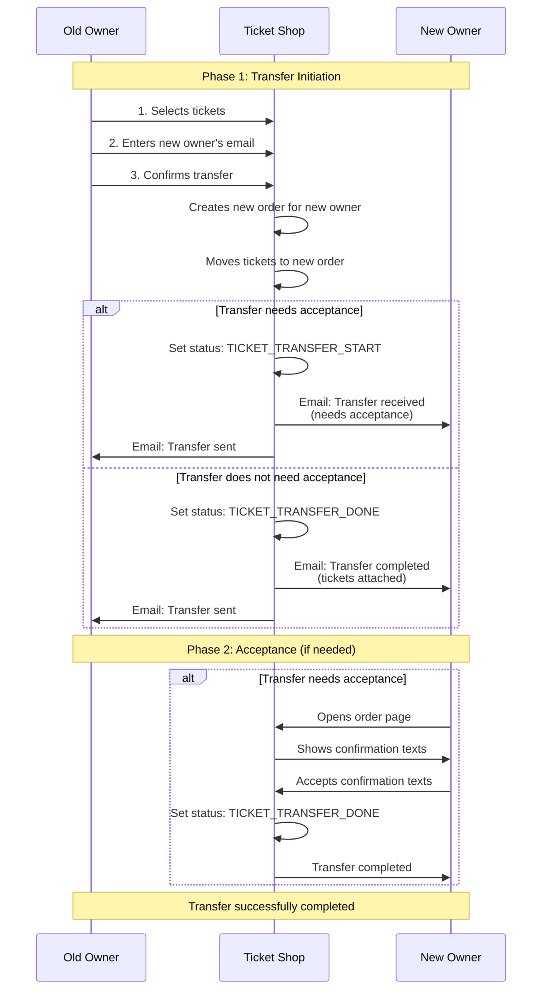

# Direct Transfer Flow

**Direct transfer** between owners without the ticket shop acting as an intermediary for payment/refund.

## Sequence Diagram (simplified)

## Status Values

- `TICKET_TRANSFER_START (1)`: Transfer initiated, new owner needs to accept
- `TICKET_TRANSFER_DONE (2)`: Transfer completed
- `TICKET_TRANSFER_SENT (23)`: Original order marked as transfer sent

## Key Functions

- `user_split()`: Creates new order and moves tickets
- `notify_user_split_order_source()`: Sends email to old owner
- `notify_user_split_order_target()`: Sends email to new owner
- `TicketTransferAccept`: View for new owner to accept transfer
- `transfer_needs_accept()`: Checks if confirmation texts are required

## Differences to Intermediated Flow

The **Direct Flow** transfers tickets directly between owners without the ticket shop acting as an intermediary for payment/refund.

The **Intermediated Flow** uses the ticket shop as an intermediary:
- Shop collects payment from new owner
- Shop processes refund to old owner
- Shop mediates the financial transaction

- **No payment required**: Tickets are transferred immediately without payment
- **No refund**: Old owner does not receive a refund
- **Acceptance step**: New owner may need to accept confirmation texts
- **Simpler process**: Only 2-3 steps instead of payment flow
