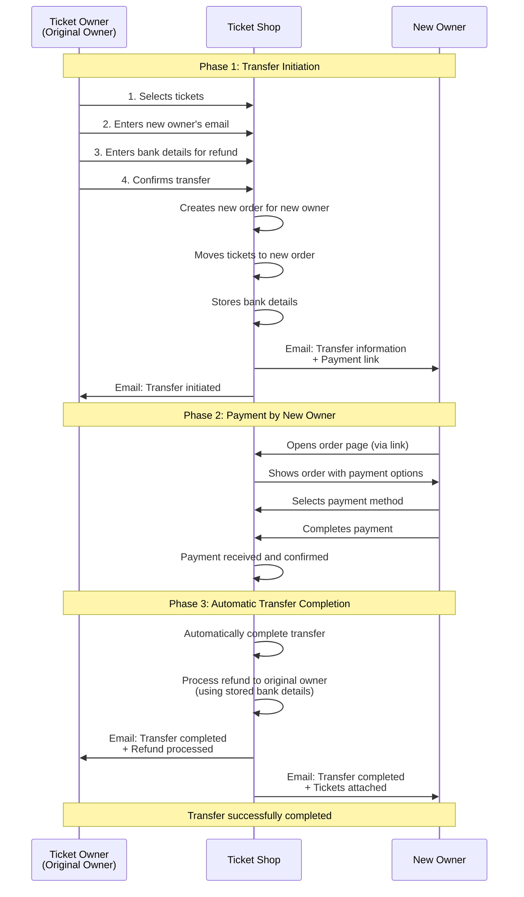

# Intermediated Transfer Flow

**Intermediated transfer** with the ticket shop acting as intermediary:
- Shop collects payment from new owner
- Shop processes refund to old owner
- Shop mediates the financial transaction

## Sequence Diagram (simplified)

## Status Values

- `TICKET_TRANSFER_PENDING_PAYMENT (3)`: Transfer initiated, waiting for new owner's payment
- `TICKET_TRANSFER_COMPLETED (4)`: Transfer completed, original owner has been refunded
- `TICKET_TRANSFER_SENT (23)`: Original order marked as transfer sent

## Key Functions

- `initiate_transfer_with_payment()`: Creates new order for new owner
- `complete_transfer_after_payment()`: Completes transfer and processes refund
- `handle_transfer_payment()`: Signal handler for `order_paid` event
